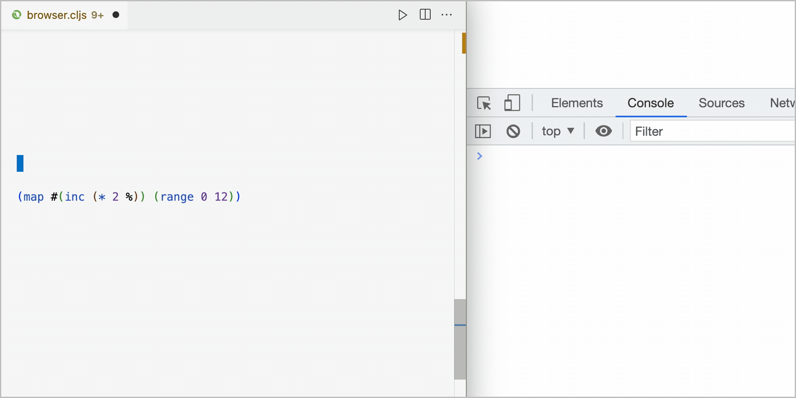
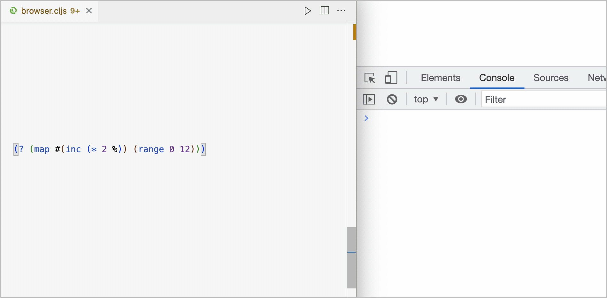
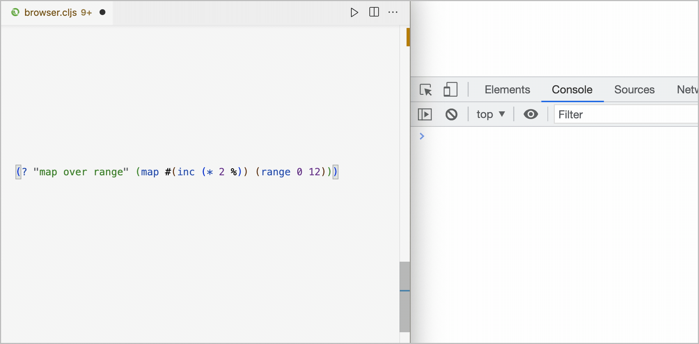

# par


[](https://clojars.org/org.clojars.paintparty/par)


A Clojure(Script) library designed to print-and-return values.
Designed to wrap existing forms in your source code so they can be observed without changing the execution of the program. Whether you are logging to a browser console from ClojureScript or a terminal console from Clojure, printed values will have similar (if not identical) formatting.

The screen recordings below show the editor (left), and Chrome DevTools Console (right).<br/>

<br>


<br>
<br>

Example below demonstrates passing a comment to display (instead of the form being evaluated).
<br/>



<br>
<br>

Example below demonstrates passing a comment and the keyword `:form` to display both the comment and the form being evaluated.
<br/>




## Usage

Add as a dependency to your project:

```clojure
[org.clojars.paintparty/par "2.0.0"]
```

Import into your namespace:

```clojure
(ns myns.core
  (:require
    [par.core :refer [? !? ?j !?j]]))

;; :refer-macros syntax will work as well.
(ns myns.core
  (:require
    [par.core :refer-macros [? !? ?j !?j]]))
```

<br>

### `?`

Use the `par.core/?` macro to print the form and resulting value. You should expect the same console output whether you are using Clojure or ClojureScript:

```Clojure
(? (+ 1 2))
```
The example above would print the following:

```Clojure
(+ 1 2) => 3
```

<br>

**If you would like to add some commentary to your logs:**
```Clojure
(? "Note to self" (+ 1 2))
```
The above will prepend the first argument to the output.<br>
The form that is being evaluated will not be printed.<br>
The example above would print the following:

```Clojure
Note to self => 3
```
<br>

**If you would like both the commentary and form to be printed:**

```Clojure
(?+ "Note to self" :form (+ 1 2))
```
The example above would print the following:

```Clojure
Note to self
(+ 1 2) => 3
```

<br>

###  `?j`
`par.core/?j`is designed to be used when you want to use `js/console.log` under the hood in order to leverage `binaryage/cljs-devtools`. Make sure that you have "Enable custom formatters" checked in Chrome's Developer Tools. This can be found in Chrome via `View` > `Developer` > `Developer Tools`, and then click on the settings gear at the top of the Dev Tools panel.  The "Enable custom formatters" toggle is in the `Console` section.

<br>

###  `!?` and `!?j`
`par.core/!?` and `par.core/!?j` are both no-op macros, useful when you want to temporarily silence the printing on a form that is already wrapped by `?` or `?j`.

<br>


## Roadmap

- Create companion production stub (no-op) library to include for prod builds (Feb '23).
- Incorporate a custom pretty-printer (Apr '23)


## License

Copyright © 2020-2023 Jeremiah Coyle

This program and the accompanying materials are made available under the
terms of the Eclipse Public License 2.0 which is available at
http://www.eclipse.org/legal/epl-2.0.

This Source Code may also be made available under the following Secondary
Licenses when the conditions for such availability set forth in the Eclipse
Public License, v. 2.0 are satisfied: GNU General Public License as published by
the Free Software Foundation, either version 2 of the License, or (at your
option) any later version, with the GNU Classpath Exception which is available
at https://www.gnu.org/software/classpath/license.html.
