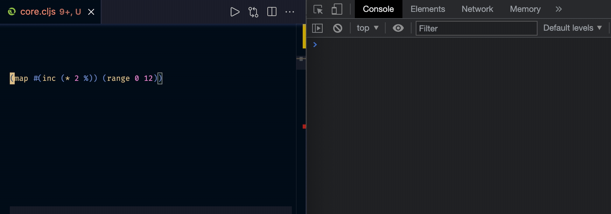

# par

A Clojure(Script) library designed to print-and-return values.

[](https://clojars.org/org.clojars.paintparty/par)

Intended to wrap existing forms in your source code so they can be observed without changing the execution of the program.

<br>

The screen recording above shows the editor (left), and Chrome DevTools Console (right).<br/>

The sequence of edits demonstrates each of the 3 arities for `par.core/?`.

## Usage

Add as a dependency to your project:

```clojure
[org.clojars.paintparty/par "1.0.0"]
```

Import into your namespace:

```clojure
(ns myns.core
  (:require
    [par.core :refer [? !? ?+ !?+]]))

;; :refer-macros syntax will work as well.
(ns myns.core
  (:require
    [par.core :refer-macros [? !? ?+ !?+]]))
```

<br>

### `?`

Use the `par.core/?` macro to print the form and resulting value. You should expect the same console output whether you are using Clojure or ClojureScript:

```Clojure
(? (+ 1 2))
```
The example above would print the following:

```Clojure
(+ 1 2) => 3
```

<br>

**If you would like to add some commentary to your logs:**
```Clojure
(? "Note to self" (+ 1 2))
```
The above will prepend the first argument to the output.<br>
The output will be italicized, with a leading "; ".<br>
The form that is being evaluated will not be printed.<br>
The example above would print the following:

```Clojure
; Note to self
 => 3
```
<br>

**If you would like both the commentary and form to be printed:**

```Clojure
(?+ "Note to self" :form (+ 1 2))
```
The example above would print the following:

```Clojure
; Note to self
(+ 1 2) => 3
```

<br>

### `?+`
When you want to log from inside a `defmacro`, or inside a function that is being called by a `defmacro`, the `?+` macro should be used. It has the exact same signature as `?`.

<br>

###  `!?` and `!?+`
`par.core/!?` and `par.core/!?+` are both no-op macros, useful when you want to temporarily silence the printing on a form that is already wrapped by `?` or `?+`.

<br>

## License

Copyright © 2020-2021 Jeremiah Coyle

This program and the accompanying materials are made available under the
terms of the Eclipse Public License 2.0 which is available at
http://www.eclipse.org/legal/epl-2.0.

This Source Code may also be made available under the following Secondary
Licenses when the conditions for such availability set forth in the Eclipse
Public License, v. 2.0 are satisfied: GNU General Public License as published by
the Free Software Foundation, either version 2 of the License, or (at your
option) any later version, with the GNU Classpath Exception which is available
at https://www.gnu.org/software/classpath/license.html.
